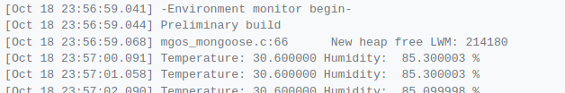

# environment-monitor
ESP32 IoT device to monitor environment data and upload it to a webserver

The Web Server serves a hardcoded HTML page that is manipulated using C/C++
to display the sensors data. The page is reloaded every three seconds using
simple JavaScript code so the sensor data being displayed remains updated.

## Work-in-Progress Arduino-ESP32 Branch:
* Use [Arduino-ESP32 by Espressif](https://github.com/espressif/arduino-esp32) instead of Mongoose OS
* Programmed in C/C++ and HTML/CSS
* Web Server available on LAN

## To Do:
* Display and update the sensors data without reloading
* Add a library for MQ135
* Make the hosted webpage look better with CSS
