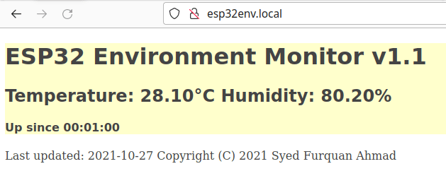
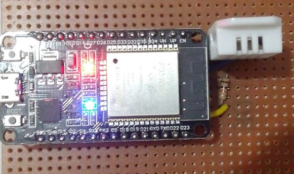

#  environment-monitor
ESP32 IoT device to monitor environment data and upload it to a webserver

The Web Server serves a hardcoded HTML page that is manipulated using C/C++
to display the sensors data. The page is reloaded every three seconds using
simple JavaScript code so the sensor data being displayed remains updated.

## Features:
* Uses [Arduino-ESP32 by Espressif](https://github.com/espressif/arduino-esp32)
* Programmed in C/C++ and HTML/CSS
* Web Server available on LAN

## How to build:
The easiest way to build the project and upload it to an ESP32 board would be
using the [Arduino IDE](https://www.arduino.cc/en/software/).
* Get the [Arduino-ESP32 core](https://github.com/espressif/arduino-esp32)
* Download the Adafruit Unified Sensor library along with the Adafruit DHT22
library from the Library Manager
* Build and upload the code

## To Do:
* Use JavaScript and standard web technologies instead of manipulating
hardcoded HTML/CSS using C/C++ and serving it
* Add a library for MQ135
* Add an LCD screen to display the connected IP address for better visibility
